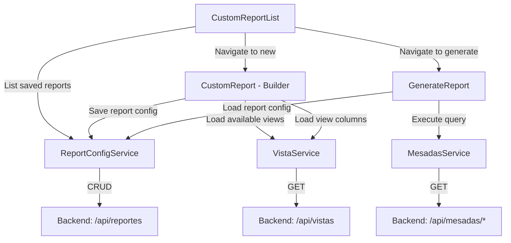
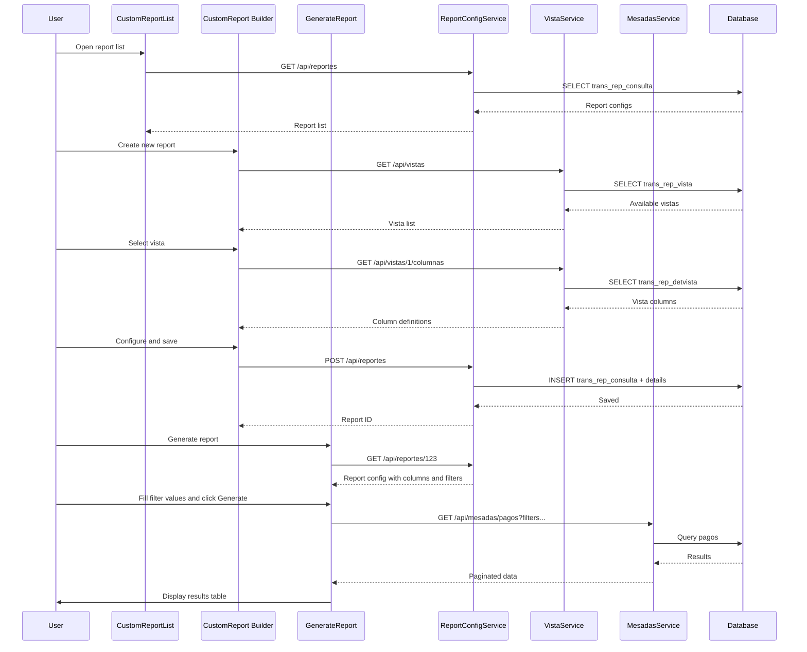

# Plan: Integrate MesadasController Endpoints into Custom Reports Frontend

## Context

The backend has 3 endpoints in [`MesadasController`](src/main/java/com/davivienda/pensionados/controller/MesadasController.java:24):

| Endpoint | Method | Response Type | Paginated |
|---|---|---|---|
| `GET /api/mesadas/pagos` | `consultarPagos` | `PaginatedResponse<PagoMesadaDto>` | Yes |
| `GET /api/mesadas/rechazos` | `consultarRechazos` | `PaginatedResponse<RechazoMesadaDto>` | Yes |
| `GET /api/mesadas/certificados` | `consultarCertificados` | `List<CertificadoMesadaDto>` | No |

The frontend has a **custom-reports module** with:
- **CustomReportList** — lists saved reports (currently hardcoded)
- **CustomReport** — report builder UI (select columns, filters, ordering)
- **GenerateReport** — executes a report and displays results with export options

The database has metadata tables for report configuration:
- `trans_rep_vista` / `trans_rep_detvista` — define available data views and their columns
- `trans_rep_consulta` / `trans_rep_detconsulta` — saved report configurations (which columns selected, naming, alignment)
- `trans_rep_filtrocons` — saved filter configurations per report

**Goal:** Make the custom-reports frontend dynamic so it can consume the mesadas endpoints (and future endpoints) without frontend code changes per report type.

---

## Architecture Overview



---

## Phase 1: Backend — Report Configuration CRUD API

### 1.1 Create `ReportConfigController`
**File:** `src/main/java/.../controller/ReportConfigController.java`

Endpoints:
- `GET /api/reportes` — List all saved reports (from `trans_rep_consulta`)
- `GET /api/reportes/{id}` — Get a single report config with its columns and filters
- `POST /api/reportes` — Create a new report config
- `PUT /api/reportes/{id}` — Update a report config
- `DELETE /api/reportes/{id}` — Delete a report config

### 1.2 Create `VistaController`
**File:** `src/main/java/.../controller/VistaController.java`

Endpoints:
- `GET /api/vistas` — List all available vistas (from `trans_rep_vista`)
- `GET /api/vistas/{id}/columnas` — Get columns for a vista (from `trans_rep_detvista`)

### 1.3 Create DTOs
- `ReportConfigDto` — maps `trans_rep_consulta` + nested `detconsulta` + `filtrocons`
- `VistaDto` — maps `trans_rep_vista`
- `VistaColumnaDto` — maps `trans_rep_detvista`

### 1.4 Create Repositories
- `ReportConfigRepository` (JPA for `transRepConsulta`)
- `ReportDetconsultaRepository` (JPA for `transRepDetconsulta`)
- `ReportFiltroconsRepository` (JPA for `transRepFiltrocons`)
- `VistaRepository` (JPA for `transRepVista`)
- `VistaDetRepository` (JPA for `transRepDetvista`)

### 1.5 Create Services
- `ReportConfigService` — CRUD logic for report configurations
- `VistaService` — Read-only logic for vistas and columns

---

## Phase 2: Frontend — TypeScript Models and Services

### 2.1 Create TypeScript Interfaces
**File:** `src/app/domain/models/mesadas.model.ts`

```typescript
export interface PagoMesada {
  identificadorDetalle: number;
  numeroAfiliacionPago: number;
  oficinaApertura: string;
  numeroCuentaPensionado: string;
  fechaAbonoMesada: string;
  numeroIdPensionado: number;
  tipoId: string;
  tipoIdentificacion: string;
  tipoIdColpensiones: string;
  nombrePensionado: string;
  numeroCuentaPagadora: string;
  valorMesada: number;
  estadoPago: string;
  numeroIdEmpresa: number;
  nombreEmpresa: string;
}

export interface RechazoMesada {
  identificadorDetalle: number;
  numeroAfiliacionPago: number;
  // ... same as PagoMesada but with motivoRechazo instead of estadoPago
  motivoRechazo: string;
}

export interface CertificadoMesada {
  tipoDocumento: string;
  numeroDocumento: string;
  primerApellido: string;
  segundoApellido: string;
  primerNombre: string;
  segundoNombre: string;
  periodoNomina: string;
  referencia: string;
  banco: string;
  sucursal: string;
  cuenta: string;
  tipoCuenta: string;
  valorNeto: number;
  estadoPago: string;
  fechaPago: string;
  descripcionCausalNoPago: string;
  causalNoPago: string;
}

export interface MesadasQueryParams {
  fechaInicio: string;  // ISO date yyyy-MM-dd
  fechaFin: string;
  empresa?: number;
  afiliacion?: number;
  cuentaPensionado?: number;
  documento?: number;
  tipoDocumento?: string;
  cuentaPagadora?: number;
  page?: number;
  size?: number;
  sort?: string;
  direction?: string;
}
```

**File:** `src/app/domain/models/paginated-response.model.ts`

```typescript
export interface PaginatedResponse<T> {
  items: T[];
  totalRecords: number;
  totalPages: number;
  page: number;
  pageSize: number;
}
```

**File:** `src/app/domain/models/report-config.model.ts`

```typescript
export interface ReportConfig {
  id?: number;
  idconsulta?: number;
  idFuncionalidad?: number;
  idvista?: number;
  nomconsulta: string;
  descconsulta: string;
  encab: string;
  conteo: string;
  regcontrol: string;
  usuCreaApp?: string;
  fecCreacion?: string;
  columns: ReportColumn[];
  filters: ReportFilter[];
}

export interface ReportColumn {
  idDetconsulta?: number;
  idDetvista: number;
  nomcampo: string;
  sumcolumna: string;
  tiporelleno: string;
  tipojust: string;
  longitud: number;
}

export interface ReportFilter {
  idFiltro?: number;
  idDetvista: number;
  orden: number;
  incluyente: string;
  tipoFiltro: number;
  valFiltro: string;
}

export interface Vista {
  idvista: number;
  nomvista: string;
  descvista: string;
}

export interface VistaColumna {
  idDetvista: number;
  idvista: number;
  nomcolunna: string;
  tipoDato: string;
  longitud: number;
  estado: string;
  pertenecevista: string;
}
```

### 2.2 Create Frontend Services

**File:** `src/app/data/datasources/mesadas.datasource.ts`
- `consultarPagos(params)` → `GET /api/mesadas/pagos?...`
- `consultarRechazos(params)` → `GET /api/mesadas/rechazos?...`
- `consultarCertificados(fechaInicio, fechaFin)` → `GET /api/mesadas/certificados?...`

**File:** `src/app/data/datasources/report-config.datasource.ts`
- `listarReportes()` → `GET /api/reportes`
- `obtenerReporte(id)` → `GET /api/reportes/{id}`
- `crearReporte(config)` → `POST /api/reportes`
- `actualizarReporte(id, config)` → `PUT /api/reportes/{id}`
- `eliminarReporte(id)` → `DELETE /api/reportes/{id}`

**File:** `src/app/data/datasources/vista.datasource.ts`
- `listarVistas()` → `GET /api/vistas`
- `obtenerColumnas(idVista)` → `GET /api/vistas/{id}/columnas`

### 2.3 Create Repositories and Use Cases (following existing clean architecture pattern)

---

## Phase 3: Frontend — Wire Components to Real Services

### 3.1 Update `CustomReportList`
- Inject `ReportConfigDatasource`
- On `ngOnInit`, call `listarReportes()` instead of hardcoded data
- Map backend `PaginatedResponse` to component pagination properties
- Wire `onDelete` to call `eliminarReporte(id)`
- Wire `onEdit` to navigate with real report ID
- Wire `onGenerate` to navigate with real report ID

### 3.2 Update `CustomReport` (Report Builder)
- Inject `VistaDatasource` and `ReportConfigDatasource`
- On `ngOnInit`, load available vistas via `listarVistas()`
- When a vista is selected, load its columns via `obtenerColumnas(idVista)`
- Replace hardcoded `groupDataList` with dynamic columns from the selected vista
- Replace hardcoded `dataGroup` with vistas list
- On save, call `crearReporte()` or `actualizarReporte()` depending on whether editing
- If route has `:id` param, load existing report config via `obtenerReporte(id)`

### 3.3 Update `GenerateReport`
- Inject `MesadasDatasource` and `ReportConfigDatasource`
- On `ngOnInit`, load report config by ID from route params
- Populate `filterList`, `columnsList`, and `reportSettings` from the loaded config
- Map the vista/endpoint association to determine which mesadas endpoint to call
- On "Generar" button click, build query params from filter values and call the appropriate endpoint
- Display results in the table using the configured columns
- Implement export methods (Excel, CSV, TXT, PDF) using the fetched data

### 3.4 Endpoint Mapping Strategy
The `trans_rep_vista.nomvista` field should map to a backend endpoint path. For example:
- Vista "Pagos de mesadas" → `/api/mesadas/pagos`
- Vista "Rechazos de mesadas" → `/api/mesadas/rechazos`
- Vista "Certificados de mesadas" → `/api/mesadas/certificados`

This mapping can be stored in the vista metadata or configured in a frontend mapping object.

---

## Phase 4: Export Functionality

### 4.1 Excel Export
- Use a library like `xlsx` (SheetJS) or call a backend export endpoint
- Generate from the `resultsList` data with configured `columnsList`

### 4.2 CSV/TXT Export
- Generate client-side from `resultsList` using configured column separators

### 4.3 PDF Export
- Use `jspdf` + `jspdf-autotable` or call a backend PDF generation endpoint
- Apply paper size, orientation, and font size settings from the UI

---

## Data Flow Diagram



---

## Files to Create/Modify Summary

### Backend (New Files)
| File | Purpose |
|---|---|
| `controller/ReportConfigController.java` | CRUD API for report configurations |
| `controller/VistaController.java` | API for vistas and columns |
| `service/ReportConfigService.java` | Business logic for report configs |
| `service/VistaService.java` | Business logic for vistas |
| `repository/ReportConfigRepository.java` | JPA repo for transRepConsulta |
| `repository/ReportDetconsultaRepository.java` | JPA repo for transRepDetconsulta |
| `repository/ReportFiltroconsRepository.java` | JPA repo for transRepFiltrocons |
| `repository/VistaRepository.java` | JPA repo for transRepVista |
| `repository/VistaDetRepository.java` | JPA repo for transRepDetvista |
| `dto/ReportConfigDto.java` | DTO for report config |
| `dto/VistaDto.java` | DTO for vista |
| `dto/VistaColumnaDto.java` | DTO for vista column |

### Frontend (New Files)
| File | Purpose |
|---|---|
| `domain/models/mesadas.model.ts` | TypeScript interfaces for mesadas DTOs |
| `domain/models/paginated-response.model.ts` | Generic paginated response interface |
| `domain/models/report-config.model.ts` | TypeScript interfaces for report config |
| `data/datasources/mesadas.datasource.ts` | HTTP calls to mesadas endpoints |
| `data/datasources/report-config.datasource.ts` | HTTP calls to report config CRUD |
| `data/datasources/vista.datasource.ts` | HTTP calls to vista endpoints |

### Frontend (Modified Files)
| File | Changes |
|---|---|
| `custom-report-list.ts` | Replace hardcoded data with service calls |
| `custom-report.ts` | Load vistas/columns dynamically, save/load config |
| `generate-report.ts` | Load config, execute queries, display real data |
| `custom-reports-module.ts` | Add HttpClientModule, register providers |
